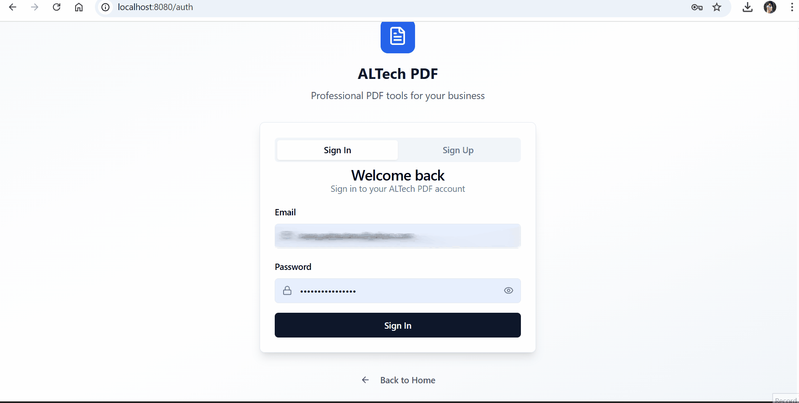
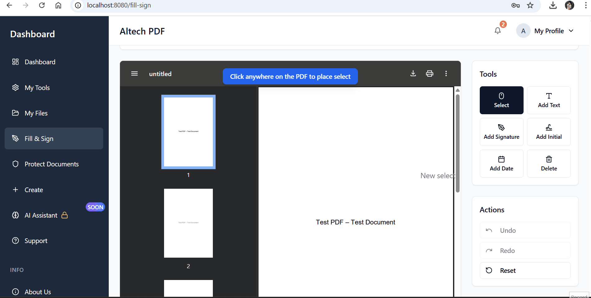
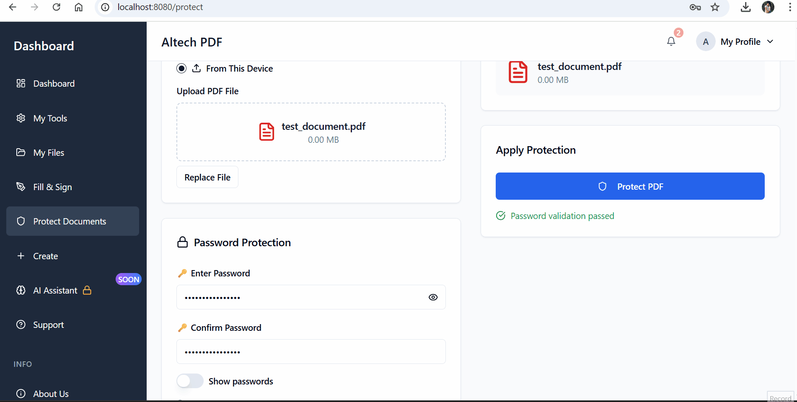
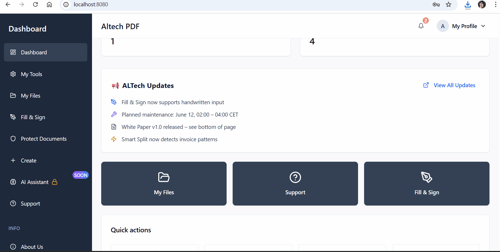
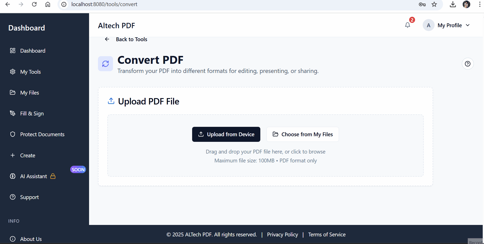

# 📚 ALTech PDF – All-in-One PDF Editing Platform

*ALTech PDF* is a powerful, full-stack web application built for modern PDF manipulation. From splitting, merging, and protecting files to signature drawing and AI-assisted document creation – everything is streamlined, fast, and accessible.  

🚀 *Currently in Beta – all features are FREE during the open testing phase!*

---

## ✨ Key Features

- 🔐 *Protect PDFs* – Add passwords, restrict copy/print/edit permissions
- ✍️ *Fill & Sign* – Draw signatures directly and fill out documents interactively
- 📄 *Split & Merge* – Divide or combine PDFs intuitively
- 📥 *Extract Pages* – Select and extract any pages you want
- 🔃 *Reorder Pages* – Drag and drop to rearrange PDF pages visually
- 📤 *Convert PDFs* – Convert between formats (coming soon)
- 🧠 *AI Assistant* – Smart suggestions and form recognition (planned)
- ☁️ *My Files* – Secure in-browser file manager to save your documents
- 🛠️ *Admin Dashboard* – Send notifications, announcements, and control features
- 📬 *Email Verification* – Secure user registration with verification code

---

## 📸 Quick Demo

### 🏠 Dashboard & Navigation

### ✍️ Fill & Sign a Document

### 🔐 Protect PDF with Password

### 📤 Extract Specific Pages

### 🔄 Convert Documents (PDF ⇄ DOCX / PPTX)

---

## 🔧 Tech Stack

| Layer        | Technology                      |
|--------------|----------------------------------|
| *Frontend* | React + TypeScript              |
| *Backend*  | Django + Django REST Framework  |
| *PDF Engine* | PyPDF2, pikepdf, ReportLab      |
| *Storage*  | Custom file manager (My Files)  |
| *Auth*     | Token-based with email validation |
| *Deployment* | Planned: Vercel + Render / Railway |
| *Mobile Apps* | Upcoming Android & iOS apps     |

---

## 📈 Roadmap

This project is in rapid development. The Beta version is stable and live.

### ✅ Phase 1: MVP Beta (In Progress)
- [x] All PDF tools fully functional
- [x] Real file uploads and downloads
- [x] My Files persistent storage
- [x] Secure authentication
- [x] Email verification on signup
- [x] Admin panel (partial)
- [x] GIF previews + marketing materials

### 🚧 Phase 2: Final Beta (Next 2 weeks)
- [ ] Real-time notification system
- [ ] Finalize admin dashboard tools
- [ ] Public launch announcement
- [ ] Full test coverage & stress testing

### 🚀 Phase 3: Post-Beta
- [ ] Launch Android/iOS apps (same backend)
- [ ] Enable AI-powered Fill & Sign Assistant
- [ ] Add payment system (PayPal/Stripe)
- [ ] Upgrade file storage system
- [ ] Open for public contributors & feedback

---

## 💬 Why ALTech PDF?

Unlike traditional PDF tools, ALTech PDF offers:

✅ Full feature access during beta  
✅ Fast, clean and responsive interface  
✅ Powerful backend, ready for scale  
✅ Built by a solo developer with a vision for quality and precision  
✅ Ideal for freelancers, companies, teachers and document-heavy users  

ALTech PDF isn’t just a tool – it’s a **platform**.

---

## 🙌 Get Involved

If you like the project:

🌟 *Give it a star*  
🐛 *Report bugs or suggest features via Issues*  
💡 *Contribute or collaborate – PRs welcome*  
📣 *Follow the roadmap – big things coming*

---

## 📬 Contact

For questions, collaborations, or feedback:

*GitHub*: (https://github.com/Alexandru95Py)  
*Email*: alexandru.goga18@gmail.com 
*Website*: Coming soon!

---

## 🧠 Built with discipline, passion and vision  
### By Alexandru Goga – aspiring Full Stack Developer